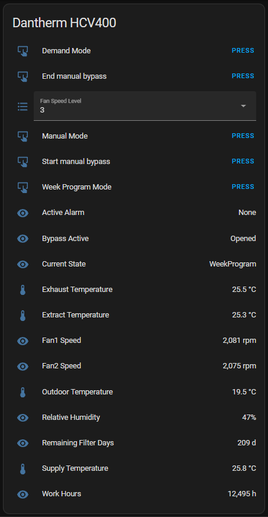

# Dantherm2mqtt

This program connects to a Dantherm UVC Controller (Currently only tested with a HCV400) over the Modbus TCP/IP Port and publishes it current state to MQTT.

## Features

### Publish current state to MQTT

Example value posted to the state topic (By default `dantherm/status/<device-serial>`):

```json
{
  "kind": "DanthermUvc",
  "spec": {
    "address": "192.168.0.21",
    "port": 502,
    "slaveAddress": 1,
    "pollingIntervalMS": 30000
  },
  "status": {
    "macAddress": "FF:FF:FF:FF:FF:FF",
    "serialNum": 123456789,
    "systemName": "Ventilation unit",
    "fwVersion": {
      "major": 2,
      "minor": 95
    },
    "systemId": {
      "fP1": true,
      "week": false,
      "bypass": true,
      "lrSwitch": false,
      "internalPreheater": true,
      "rhSensor": true,
      "vocSensor": false,
      "extOverride": false,
      "haC1": true,
      "hrC2": true,
      "pcTool": false,
      "apps": false,
      "zigBee": false,
      "dI1Override": false,
      "dI2Override": true,
      "unitType": "HCV400_P2"
    },
    "halLeft": true,
    "halRight": false,
    "dateTime": "2023-09-04T20:06:34Z",
    "workTimeHours": 12495,
    "startExploitation": "2022-04-01T10:31:39Z",
    "currentBLState": "WeekProgram",
    "outdoorTemperatureC": 19.393528,
    "supplyTemperatureC": 25.784779,
    "extractTemperatureC": 25.290403,
    "exhaustTemperatureC": 25.483688,
    "filterRemaningTimeDays": 209,
    "lastActiveAlarm": "None",
    "halFan1Rpm": 2082.2507,
    "halFan2Rpm": 2077.2612,
    "relativeHumidity": 47,
    "bypassState": "Opened",
    "fanSpeedLevel": 3
  }
}
```

### Home Assistant MQTT Discovery

Makes the current status available automatically through the Home Assistant user interface:



### Prometheus Metric Endpoint

It has a prometheus metrics endpoint at `/metrics` with the following metrics related to Dantherm:

| Metric Name                          | Labels                       | Description                                                                                                                               |
| ------------------------------------ | ---------------------------- | ----------------------------------------------------------------------------------------------------------------------------------------- |
| `danthermtomqtt_last_active_alarm`   | `device_serial`              | The last active alarm, zero = none, see [Dantherm documentation](docs/Dantherm%20UVC%20Controller%20-%20Modbus%20TCP%20IP.pdf) if not `0` |
| `danthermtomqtt_last_data_pull_time` | `succeeded`, `device_serial` | The last time data either failed or pulled successfully                                                                                   |

## How to deploy

The application is distributed using a docker image available at [jonasmh/dantherm2mqtt](https://hub.docker.com/r/jonasmh/dantherm2mqtt)

### Docker Compose

Example docker-compose:

```yaml
version: "3.4"

services:
  dantherm2mqtt:
    image: jonasmh/dantherm2mqtt:latest
    environment:
      - DanthermUvcSpec__Address=192.168.0.42
      - MqttConnectionOptions__Server=192.168.0.30
      - MqttConnectionOptions__Port=1883
      - MqttConnectionOptions__UseTls=false
```

### Configuration

| Json Key                            | Environment Varible                   | Description                             | Example        | Default                                |
| ----------------------------------- | ------------------------------------- | --------------------------------------- | -------------- | -------------------------------------- |
| `DanthermUvcSpec.Address`           | `DanthermUvcSpec__Address`,           | IP of the UVC Controller                | `192.168.1.42` | `null`                                 |
| `DanthermUvcSpec.Port`              | `DanthermUvcSpec__Port`,              | Modbus port on the UVC Controller       | `502`          | `502`                                  |
| `DanthermUvcSpec.SlaveAddress`      | `DanthermUvcSpec__SlaveAddress`,      | Slave address of the UVC Controller     | `1`            | `1`                                    |
| `DanthermUvcSpec.PollingIntervalMS` | `DanthermUvcSpec__PollingIntervalMS`, | Polling interval in ms                  | `30000`        | `30000` (30s)                          |
| `MqttConnectionOptions.Server`      | `MqttConnectionOptions__Server`,      | Server address of the MQTT Server       | `192.168.1.42` | `mosquitto`                            |
| `MqttConnectionOptions.Port`        | `MqttConnectionOptions__Port`,        | Port to connect to the MQTT Server with | `8883`         | `8883`                                 |
| `MqttConnectionOptions.UseTls`      | `MqttConnectionOptions__UseTls`,      | Use TLS to connect                      | `true`/`false` | `true`                                 |
| `MqttConnectionOptions.CaCrt`       | `MqttConnectionOptions__CaCrt`,       | CA Certificate                          | `ca.crt`       | `/data/mosquitto-client-certs/ca.crt`  |
| `MqttConnectionOptions.ClientCrt`   | `MqttConnectionOptions__ClientCrt`,   | Client Certificate                      | `tls.crt`      | `/data/mosquitto-client-certs/tls.crt` |
| `MqttConnectionOptions.ClientKey`   | `MqttConnectionOptions__ClientKey`,   | Client Key                              | `tls.key`      | `/data/mosquitto-client-certs/tls.key` |
